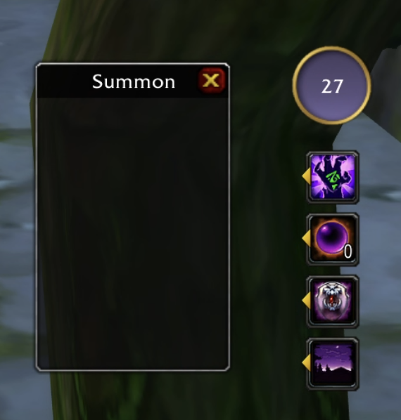

# Warlocker AddOn for Turtle WoW

This addon is in an early stage of development and for now will only work for level 60 players with an english client.

## Features
### Adaptable Spell Bar

- Reloads on spell learned or changed with the brainwashing device (one spell need to be learned for now).
- The pet main menu button will be either Fel Domination, Demonic Sacrifice or Summon Imp depending on availability.
- The stone menu allows you to click once to create a stone and click a second time to use it. It also indicates if stones are in a bag.

### Summoning Helper

This addon provides summoning helpers compatible with LockPort.

When in Raid or in Party every players typing '123' will be added to the list of players to be summoned. Left click to summon a player or right click to remove one from the list.

## Planned Features

- [ ] Settings
- [ ] UI Customization

